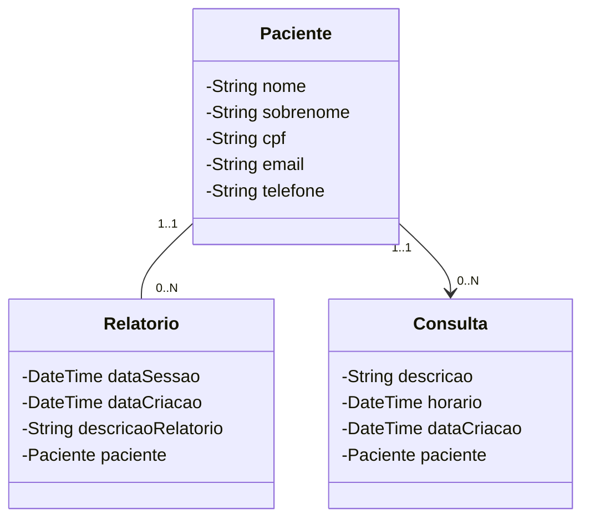

# Santander Backend 2023
Projeto API RestFul Java para Santander backend 2023.

## Diagrama de classes

```mermaid
classDiagram
  class Paciente {
    -String nome
    -String sobrenome
    -String cpf
    -String email
    -String telefone
  }

  class Consulta {
    -String descricao
    -DateTime horario
    -DateTime dataCriacao
    -Paciente paciente
  }

  class Relatorio {
    -DateTime dataSessao
    -DateTime dataCriacao
    -String descricaoRelatorio
    -Paciente paciente
  }

  Paciente "1..1"--"0..N" Relatorio
  Paciente "1..1"-->"0..N" Consulta
```
