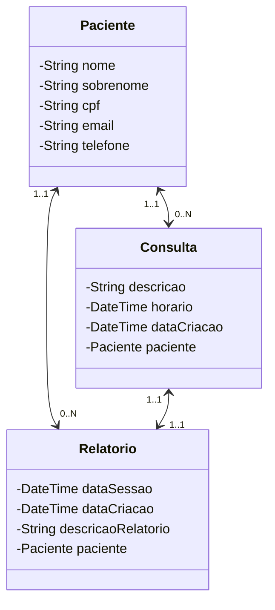

# Projeto Dio Santander Backend 2023

Projeto API Restful elaborado para desafio de projeto Dio Santander Backend 2023.

## Índice
- <a href="#diagrama">Diagrama de classe</a>
- <a href="#funcionalidades">Funcionalidades do projeto</a>
- <a href="#demonstracao">Demonstração</a>
- <a href="#rodar">Como rodar este projeto?</a> 
- <a href="#Tecnologias">Tecnologias Utilizadas</a>
- <a href="#autoras">Pessoas Autoras</a>
- <a href="#Próximos passos">Próximos passos</a>

## Diagrama de classes


## 🖥️Funcionalidades do Projeto 
- [x] Cadastro de Paciente
- [x] Consulta de Paciente
- [x] Exclusao do Paciente
- [x] Atualização de Paciente
- [x] Cadastro de Consulta
- [x] Buscar Consulta
- [x] Cadastro de Relatórios por consulta
- [x] Consultar Relatório por nome do Paciente

## 📺Layout


## Demonstração
[Projeto](https://dio-api-restful-production.up.railway.app/swagger-ui/index.html)


## 💿Como Rodar este projeto
```bash
# Clone o repositório 
$ git clone https://github.com/reynaldo86/Dio-Api-Restful.git

# Acesse a pasta do projeto
$ cd Dio-Api-Restful

# Instale as dependências
$ mvn clean install

# Execute o projeto
Abra o projeto na IDE de sua preferência.

# Configurações Adicionais:
Se o projeto usa um banco de dados, certifique-se de configurar as informações de conexão no arquivo de configuração.

Consulte o arquivo application.properties (ou application.yml) para configurar outras propriedades da aplicação, como porta, URL da base de dados, é os ambientes.

```
## 🛠️Tecnologias Utilizadas
1. [Java 17](https://www.java.com/pt-BR/)
2. [Spring Boot 3](https://spring.io/projects/spring-boot)
3. [OpenAPI (Swagger)](https://springdoc.org/)
4. [Railway](https://railway.app/)

## 👤Pessoas Autoras
</img>

[Linkedin](https://www.linkedin.com/in/reynaldo-hendson/)

## 🖊️Próximos passos
- [] Refartorar projeto
- [] Implementar camada de segurança.
- [] Conectar com Api externa de endereço
- [] Implementar pagamentos
- [] Implementar notificação via email 
- [] Implementar Frontend
